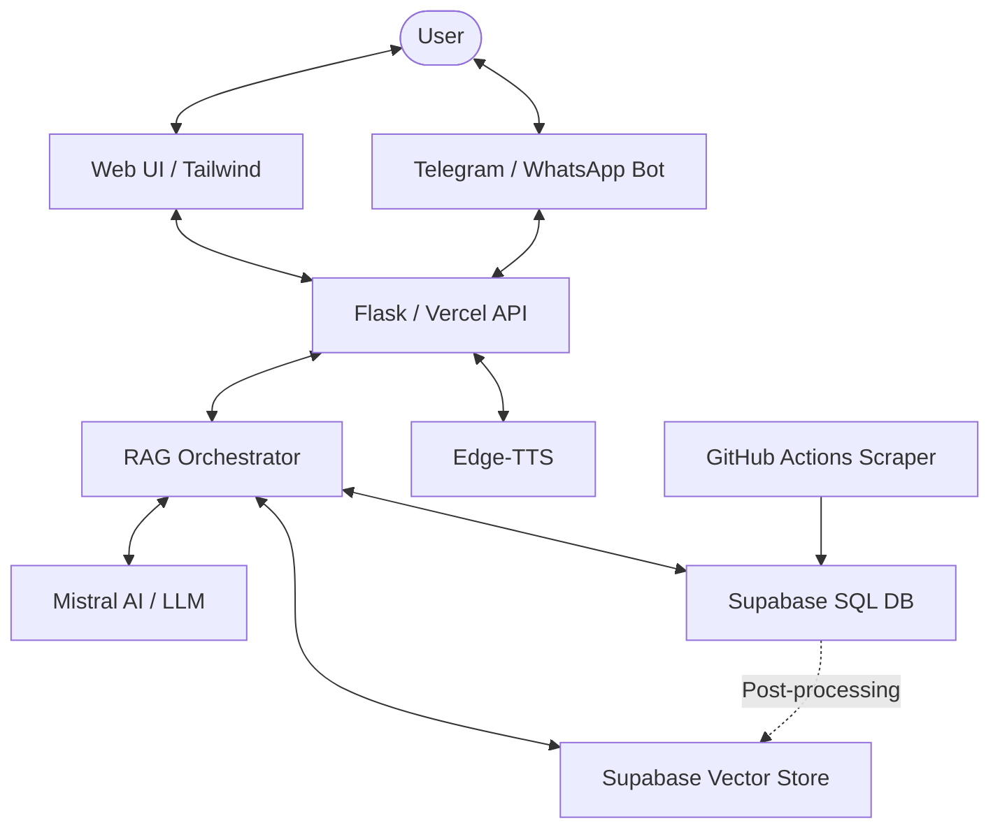

# 🏗️ Yojana AI: Technical Architecture & Workflow

This document provides a deep dive into the technical architecture, data processing pipelines, and the RAG (Retrieval-Augmented Generation) flow of the **Yojana AI** project.

---

## 📐 System Architecture

The following diagram illustrates the high-level interaction between global components:

---

## 🔄 1. Data Ingestion Pipeline (The Scraper)

Ensuring data freshness is critical. Yojana AI employs an automated synchronization pipeline:

1.  **Orchestration**: A GitHub Action (`.github/workflows/sync_data.yml`) triggers every 24 hours.
2.  **Scraping**: A Playwright-based script (`scraper/myscheme_scraper.py`) visits the official `myscheme.gov.in` portal.
3.  **Deduplication**: Data is compared against existing entries in the Supabase `schemes` table using a unique hash of the scheme content.
4.  **Vectorization**: New or modified schemes are passed through the `mistral-embed` model.
5.  **Persistence**:
    -   **Metadata**: Stored in a standard PostgreSQL table.
    -   **Embeddings**: Stored in a `documents` table using the `pgvector` extension (1024-D vectors).

---

## 🧠 2. The RAG Pipeline (The "Ask Assistant" Flow)

When a user submits a query via Web, Telegram, or WhatsApp, the `ask_agent` workflow in `rag/agent.py` executes the following phases:

### Phase A: Language & Intent Analysis
-   **Language Detection**: Detects if the query is in English, Hindi, or Gujarati.
-   **Internal Translation**: If non-English, the query is translated into English for optimized embedding matching.
-   **Intent Classification**: The LLM classifies the intent:
    -   `names_only`: User wants a list of schemes.
    -   `full_detail`: User wants deep details of a specific scheme.
    -   `eligibility_check`: User is providing profile details to find matches.
    -   `conversational`: General greeting or Q&A.

### Phase B: Hybrid Retrieval
-   **Vector Search**: A semantic similarity search is performed via a Supabase RPC (`match_documents`) against the `pgvector` store.
-   **SQL Keyword Fallback**: If semantic search yields low-confidence scores, an `ILIKE` relational search is performed on category and name tags.

### Phase C: Eligibility Reasoning
-   If profile data is provided, the system compares the user's data (age, income, category) against the `eligibility` text field of the retrieved schemes using an LLM-based reasoning step.

### Phase D: Response Generation & Streaming
-   The LLM synthesizes the final answer using the retrieved context.
-   **Streaming**: Responses are streamed to the Web UI via Server-Sent Events (SSE) for a responsive "typing" effect.
-   **Translation**: The final English response is translated back into the user's detected/selected language (Hindi/Gujarati).

---

## 🌍 3. Omnichannel Delivery Mechanisms

-   **Web UI**: Built with Flask and Tailwind CSS. Uses Glassmorphism for a premium feel. Supports real-time "cards" for scheme display.
-   **Telegram**: Implemented as a webhook-based bot using `python-telegram-bot`.
-   **WhatsApp**: Integrated via Twilio's API.
-   **Voice Layer**: 
    -   **Input**: Browser-native Web Speech API (Edge Native STT) provides fast, low-latency transcription for the web experience.
    -   **Output**: Microsoft `Edge-TTS` generates high-quality natural voice in English, Hindi, and Gujarati.

---

## 🛠️ 4. Local Development & Testing

### Testing the RAG Logic
You can test the RAG engine without the Web UI by running experimental scripts in `scripts/` or calling `rag/agent.py` directly (if modularized for CLI).

### Environment Guardrails
-   **Vercel Serverless**: Background threads are disabled; logic must be execution-time efficient (< 60s).
-   **Supabase Secrets**: Local development requires a valid `DATABASE_URL` with SSL enabled.

---

## 🛡️ 5. Reliability & Fallbacks

-   **Visit Site Fallback**: If official links are outdated, the system automatically redirects users to the `myscheme.gov.in` homepage to prevent 404s.
-   **Hallucination Guard**: The system uses a strict "System Prompt" that prevents it from answering questions unrelated to government schemes.
-   **Rate Limiting**: Automated backoff logic handles Mistral AI and Groq API limits.
